# 🚀 LuFin - 청소년 경제 교육 플랫폼

## 👥 팀원 소개

|  |  |  |  |  |  |
| :--------------------------------------------------------------------------: | :------------------------------------------------------------------------: | :------------------------------------------------------------------------: | :----------------------------------------------------------------------: | :------------------------------------------------------------------------: | :------------------------------------------------------------------------: |
|                                이재현(팀장 / FE)                                 |                                   김서현(BE)                                   |                                   신유영(FE)                                   |                                  양은서(BE)                                 |                                   조홍균(BE)                                  |                                   최민주(FE)                                  |
|                [marunturtle](https://github.com/marunturtle)                 |                 [seohye-ki](https://github.com/seohye-ki)                  |                 [shinyou28](https://github.com/shinyou28)                  |                  [yes2489](https://github.com/yes2489)                   |                 [NekoShoot](https://github.com/NekoShoot)                  |                 [minjumost](https://github.com/minjumost)                  |

## 📚 프로젝트 개요

LuFin은 청소년들에게 경제적 개념을 재미있고 실용적으로 가르치면서 자산 관리 능력을 키우는 교육 플랫폼입니다. 초등학교 고학년과 교사들을 대상으로, 실제 경제 활동을 시뮬레이션하며 학습할 수 있는 환경을 제공합니다.

### 🎯 프로젝트 목표

- 경제 교육의 게임화를 통한 학습 동기 부여
- 실전적인 금융 시뮬레이션 경험 제공
- 신용 관리와 자산 관리 능력 향상
- 경제적 의사결정 능력 개발

## 🛠 기술 스택
| 범주                     | 기술                                                                                                   |
| ---------------------- | ---------------------------------------------------------------------------------------------------- |
| **Frontend**           | React 19, TypeScript, Vite, Zustand, Tailwind CSS, MUI, Framer Motion, Headless UI, React Router DOM |
| **Backend**            | Spring Boot, Spring Security, JPA, Hibernate, MySQL, Redis                                           |
| **Infra / DevOps**     | Jenkins, Docker, Nginx, AWS EC2                                                                      |
| **Collaboration**      | Git, GitLab, Jira, Figma, Notion                                                                     |
| **Data Visualization** | Chart.js, React Chart.js 2                                                                           |

## ✨ 주요 기능

### 📊 대시보드
> 교사와 학생의 자산, 신용점수, 미션 현황 등을 한눈에 확인할 수 있는 메인 화면입니다.
> 
> 개인화된 정보를 시각화하여 학습 동기 유발과 자기 주도적 관리가 가능합니다.

 

<table>
  <tr>
    <td colspan="2" align="center"><strong>대시보드(학생)</strong></td>
  </tr>
  <tr>
    <td>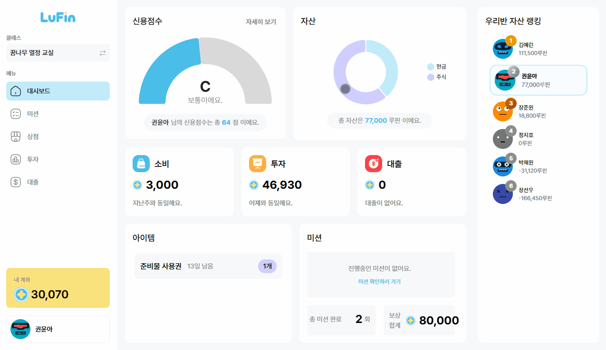</td>
    <td></td>
  </tr>
</table>
<table>
  <tr>
    <td colspan="2" align="center"><strong>대시보드(교사)</strong></td>
  </tr>
  <tr>
    <td>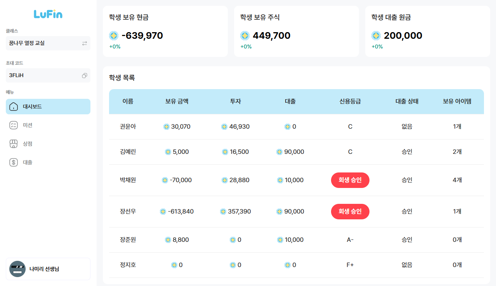</td>
    <td>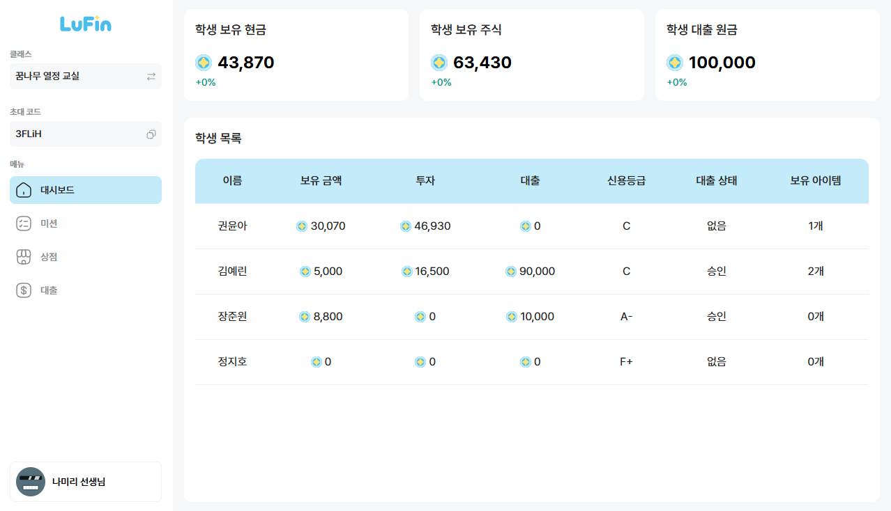</td>
  </tr>
</table>

### 🪪 신용점수
> 학생의 금융 활동 결과에 따라 신용 점수가 실시간으로 반영됩니다.
>
> 일정 점수 미만일 경우 ‘개인회생’ 절차를 거쳐 회복 가능하며, 교사의 승인 흐름도 포함됩니다.

 

<table>
  <tr>
    <td colspan="1" align="center"><strong>개인회생 신청(학생)</strong></td>
    <td colspan="1" align="center"><strong>개인회생 수락(교사)</strong></td>
    <td colspan="1" align="center"><strong>개인회생 완료(학생)</strong></td>
  </tr>
  <tr>
     <td>
        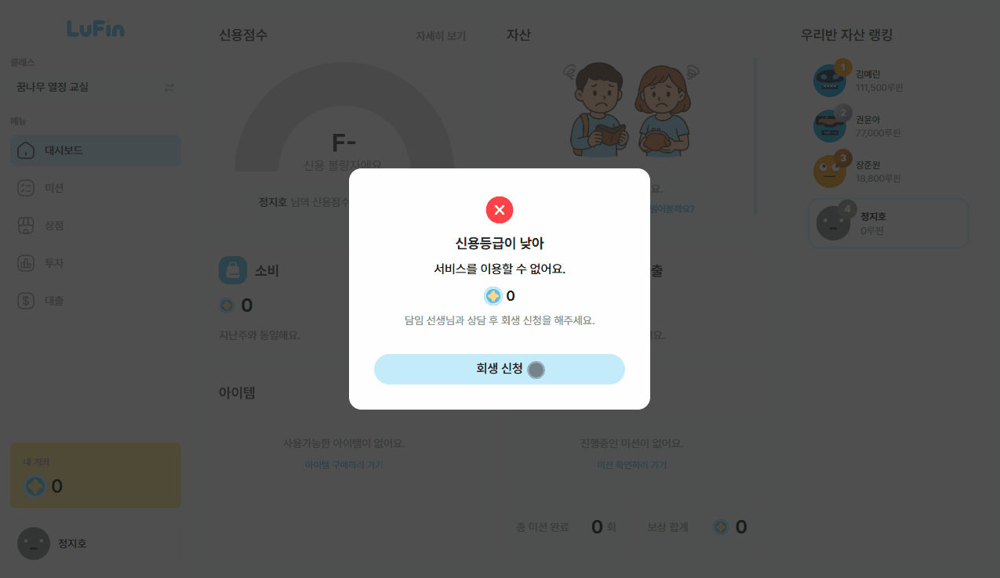
     </td>
     <td>
        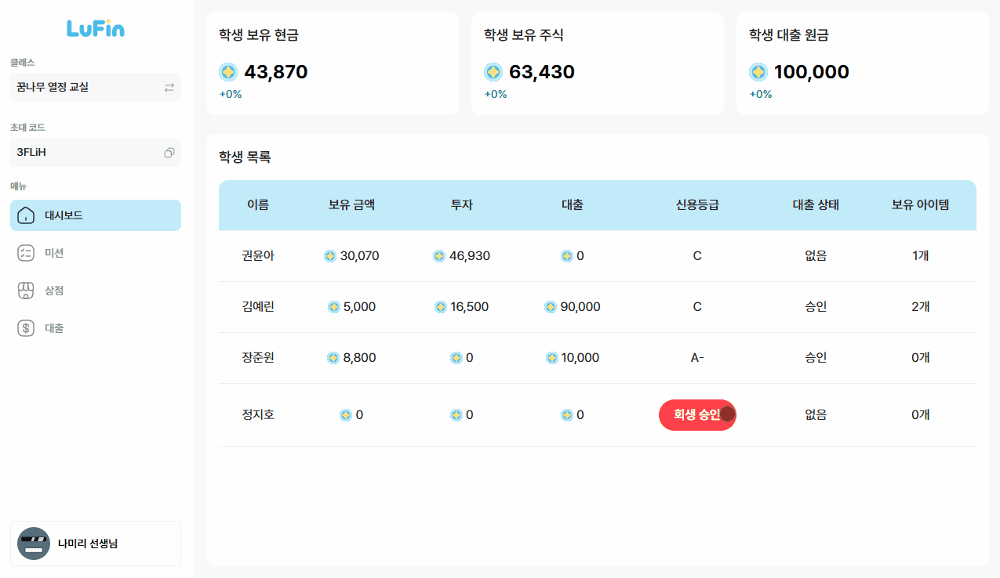
     </td>
     <td>
        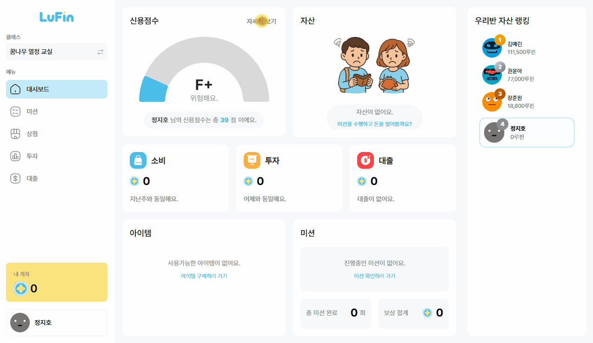
     </td>
  </tr>
</table>

### 💰 상점
> 교사는 다양한 아이템을 등록/수정/삭제할 수 있고, 학생은 이를 구매하거나 사용 요청할 수 있습니다.
>
> 구매, 환불, 사용 요청, 승인까지 전체 흐름이 반영된 소비 시스템입니다.

 

<table>
  <tr>
    <td colspan="1" align="center"><strong>아이템 생성(교사)</strong></td>
    <td colspan="1" align="center"><strong>아이템 상세조회(교사)</strong></td>
    <td colspan="1" align="center"><strong>아이템 삭제(교사)</strong></td>
  </tr>
  <tr>
     <td>
        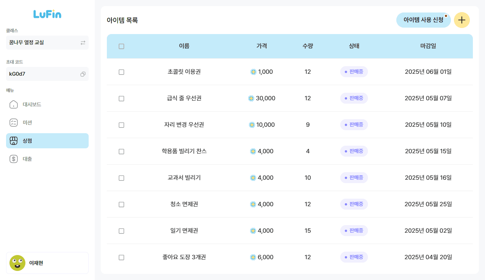
     </td>
     <td>
        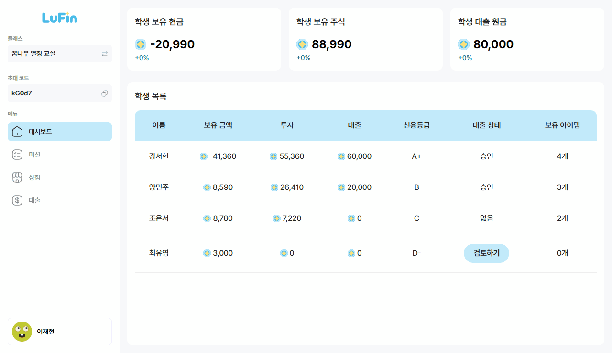
     </td>
     <td>
        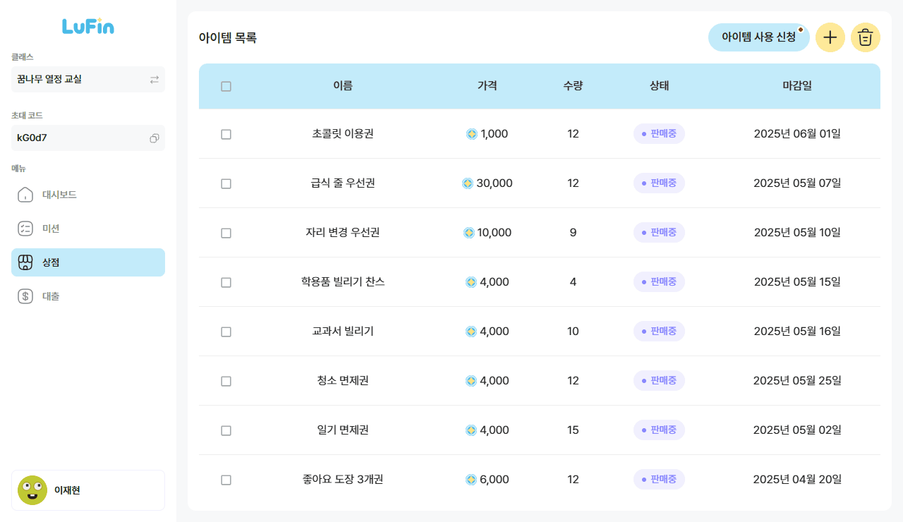
     </td>
  </tr>
</table>
<table>
  <tr>
    <td colspan="1" align="center"><strong>아이템 구매(학생)</strong></td>
    <td colspan="1" align="center"><strong>아이템 사용요청(학생)</strong></td>
    <td colspan="1" align="center"><strong>아이템 사용요청 수락(교사)</strong></td>
  </tr>
  <tr>
     <td>
        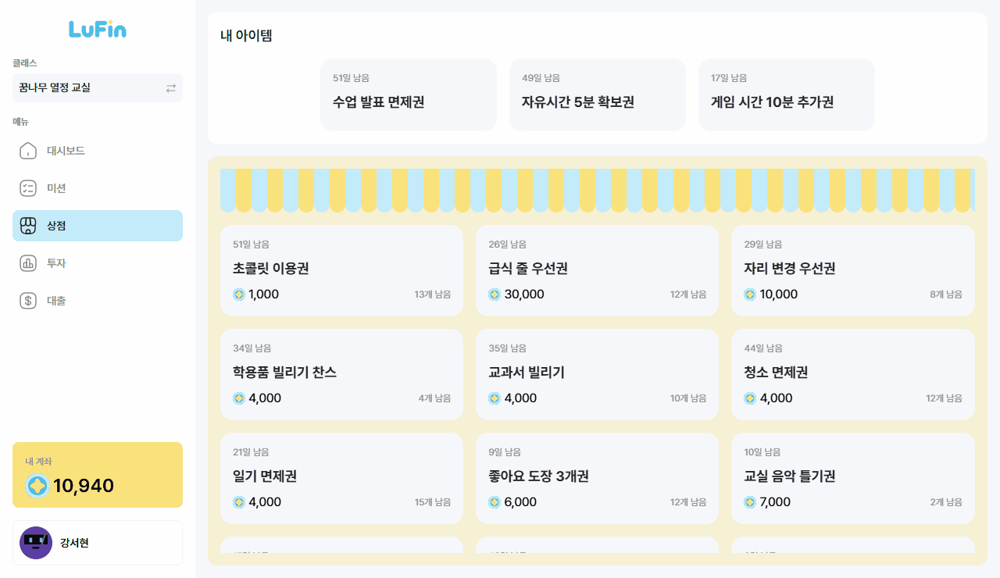
     </td>
     <td>
        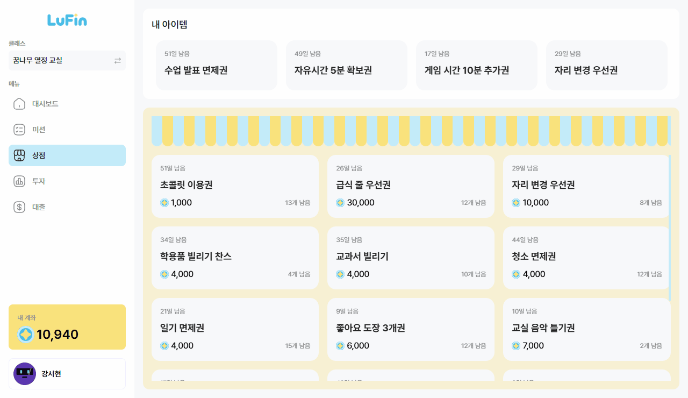
     </td>
     <td>
        
     </td>
  </tr>
</table>

### 📍 미션
> 교사는 학습 미션을 생성하고, 학생은 참여 후 결과를 제출하면 교사가 승인 또는 반려하는 구조입니다.
> 
> 미션 수행 결과는 신용점수와 포인트 보상에 직접 연결됩니다.

 

<table>
  <tr>
    <td colspan="1" align="center"><strong>미션 생성(교사)</strong></td>
    <td colspan="1" align="center"><strong>미션 신청(학생)</strong></td>
    <td colspan="1" align="center"><strong>미션 검토(교사)</strong></td>  
  </tr>
  <tr>
     <td>
        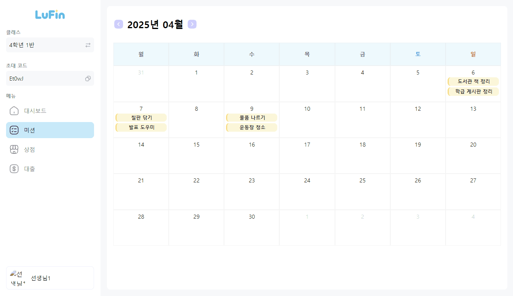
     </td>
     <td>
        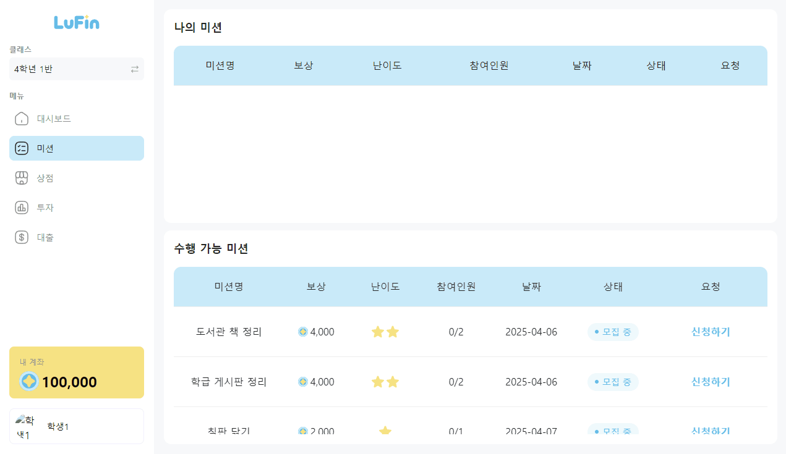
     </td>
     <td>
        
     </td>
  </tr>
</table>

### 📝 대출
> 학생은 본인의 신용등급을 기반으로 조건에 맞는 대출 상품을 신청할 수 있습니다.
> 
> 교사가 심사하여 승인 여부를 판단하고, 이자 납입 또는 연체 여부가 신용점수에 영향을 줍니다.

 

<table>
  <tr>
    <td colspan="1" align="center"><strong>대출 신청(학생)</strong></td>
    <td colspan="1" align="center"><strong>대출 승인(교사)</strong></td>
  </tr>
  <tr>
     <td>
        
     </td>
     <td>
        
     </td>
  </tr>
</table>

### 📈 투자
> 하루 2번(오전/오후) 주식 시세 변동에 따라 가상의 종목을 매수/매도할 수 있으며, 포트폴리오 수익률을 확인할 수 있습니다.
> 
> 투자 성과는 학습 동기와 자산 형성 경험을 제공합니다.

 

<table>
  <tr>
    <td colspan="1" align="center"><strong>주식 매수(학생)</strong></td>
    <td colspan="1" align="center"><strong>주식 포트폴리오(학생)</strong></td>
  </tr>
  <tr>
     <td>
        
     </td>
     <td>
        
     </td>
  </tr>
</table>

## 💳 신용 시스템 상세

### 신용 등급 체계

- **15단계 신용등급** (A+, A, A-, B+, B, B-, C+, C, C-, D+, D, D-, F+, F, F-)
- **0~100점** 범위의 신용점수 시스템
- **5점 단위** 변동으로 안정적인 등급 관리

### 신용점수 변동 요소

1. **대출 관리**

   - 이자 정상 납입: +1점
   - 이자 연체: -4점
   - 원금 상환 성공: +3점
   - 원금 상환 실패: -10점

2. **미션 수행**

   - 미션 성공: +2점
   - 미션 실패: -2점

### 신용 회생 시스템

- **F- 등급(30점 미만)** 도달 시 회생 절차 시작
- 교사 승인 후 35점(F+)으로 조정
- 단계적 금융 활동 제한 해제
- D- 등급 도달 시 정상 활동 가능

## 🎯 특장점

### Frontend 특장점

1. **실전적인 경제 교육**

   - 실제 금융 시스템을 모방한 시뮬레이션
   - 실시간 시장 상황 반영
   - 리스크 관리 학습

2. **게임화된 학습 경험**

   - 미션 기반 보상 시스템
   - 실시간 피드백
   - 경쟁 요소를 통한 동기 부여

3. **직관적인 UI/UX**

   - 모던하고 깔끔한 디자인
   - 반응형 레이아웃
   - 부드러운 애니메이션

4. **확장 가능한 아키텍처**
   - 모듈화된 컴포넌트 구조
   - 타입 안정성
   - 효율적인 상태 관리

### Backend 특장점

1. **도메인 자동 연동 시스템**

   - 상태 기반 자동 트리거
   - 단일 요청으로 복합 도메인 처리
   - 명시적 트랜잭션 제어

2. **데이터 정합성 보장**

   - 비관적 Lock 기반 동시성 제어
   - 도메인별 경쟁 조건 방지
   - 타임아웃 제어 시스템

3. **보안 중심 설계**

   - KISA 기반 시큐어 코딩
   - PBKDF2 + Salt 암호화
   - 토큰 기반 인증 시스템

4. **실전 금융 시뮬레이션**
   - 실제 은행 시스템 모방
   - 자동화된 이자 계산
   - 실시간 거래 처리

## 🏆 수상 이력
삼성 청년 SW•AI 아카데미 특화 프로젝트 우수상 (2025.04)

## 📝 라이선스

이 프로젝트는 MIT 라이선스를 따릅니다.
