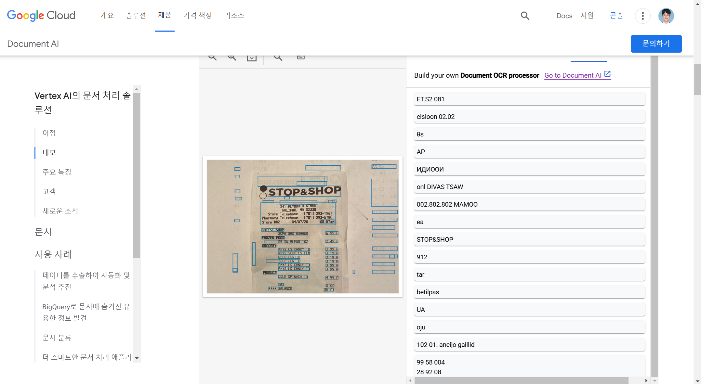

# [2025-03-04] 1일차\_아이디어 현실성 파악을 위한 OCR 기술 체험

## 🎯 학습 목표

- OCR에 대한 이해
- OCR 기술 체험
- OCR 기술 활용

## 📌 OCR이란?

### Optical Character Recognition에 대한 이해

> [!note] 광학 문자 인식, 쉽게 말하자면 이미지의 글자를 인식하고 이를 텍스트 데이터로 치환하는 기술입니다.

기존에는 전자로 출력된 영수증에서조차 사진의 음영이나 각도, 화질 여부에 따라 상대적으로 낮은 정확도를 보여왔습니다. 하지만 생성형 AI가 발전함에 따라 점차 정확도가 높아졌고, 현재는 놀랄만한 퍼포먼스를 보여주는 것 같습니다.

핀테크 도메인에서 제가 제안했던 아이디어는 "여행 중 소비내역 추적 및 기록 서비스"로, 영수증을 찍었을 때 자동으로 날짜와 금액이 기록되어야 하기 때문에 OCR 기술이 필수였습니다.

이에, 빠르고 정확한 OCR API를 제공하는 서비스를 먼저 찾아보았고, `Google Cloud Vision - Document AI`가 가성비 및 다국어 처리 능력에서 가장 뛰어나다고 판단해 찾아보게 되었습니다.

### OCR 기술 체험

Google Cloud에서 데모로 간단하게 성능을 체험해볼 수 있었기에 시도해보았습니다. 아래는 그 결과입니다.


예시 영수증 사진이 생각보다 깔끔한 경향이 있지만, 그럼에도 불구하고 아주 깔끔하게 글자들을 읽는 것을 알 수 있었습니다.
이를 토대로 실제 걸리는 시간과 정확도만 어느 정도 보장된다면, 실현성 있는 서비스를 구현할 수 있을 것이라는 생각이 들었습니다.

### OCR 기술 활용

이에 저는 현존하는 생성형 AI 보조 도구 중 가장 코딩 실력이 좋은 Claude 3.7 Sonnet Extended 모델에게 부탁해, Document AI API를 활용해 영수증의 날짜와 금액을 읽을 수 있는 아주 간단한 데모 코드를 작성해 달라고 부탁했습니다.

그 코드는 바로 아래와 같습니다.

### 🔹 코드 예제 (필요 시)

> 하기 코드는 Claude 3.7 Sonnet Extended 모델을 통해 생성한, Google Document AI API를 호출하고 그 값을 가공하는 예시 코드입니다. 아직 오류가 수정되지 않았기 때문에, 이 코드를 통한 결과값 도출은 보류 단계입니다.

```
package com.ocrtest.ocrtest.services;

import com.google.cloud.documentai.v1.*;
import com.google.protobuf.ByteString;
import org.springframework.beans.factory.annotation.Autowired;
import org.springframework.beans.factory.annotation.Value;
import org.springframework.stereotype.Service;
import org.springframework.web.multipart.MultipartFile;

import java.io.IOException;
import java.util.*;

@Service
public class ReceiptProcessorService {

    @Autowired
    private DocumentProcessorServiceClient documentProcessorServiceClient;

    @Value("${google.cloud.project-id}")
    private String projectId;

    @Value("${google.cloud.location}")
    private String location;

    @Value("${google.cloud.processor-id}")
    private String processorId;

    /**
     * 영수증 이미지를 처리하고 결과를 반환합니다.
     */
    public Map<String, Object> processReceipt(MultipartFile file) throws IOException {
        // 프로세서의 전체 이름 생성
        String name = String.format("projects/%s/locations/%s/processors/%s",
                projectId, location, processorId);

        // 파일 내용을 바이트로 변환
        ByteString content = ByteString.copyFrom(file.getBytes());

        // Document 객체 생성
        Document document = Document.newBuilder()
                .setContent(content)
                .setMimeType(determineMimeType(file.getOriginalFilename()))
                .build();

        // 처리 요청 생성
        ProcessRequest request = ProcessRequest.newBuilder()
                .setName(name)
                .setRawDocument(RawDocument.newBuilder()
                        .setContent(content)
                        .setMimeType(determineMimeType(file.getOriginalFilename()))
                        .build())
                .build();

        // Document AI에 처리 요청 보내기
        ProcessResponse response = documentProcessorServiceClient.processDocument(request);
        Document processedDocument = response.getDocument();

        // 영수증 정보 추출 및 반환
        return extractReceiptInformation(processedDocument);
    }

    /**
     * 파일 확장자를 기반으로 MIME 타입을 결정합니다.
     */
    private String determineMimeType(String filename) {
        if (filename != null) {
            filename = filename.toLowerCase();
            if (filename.endsWith(".pdf")) {
                return "application/pdf";
            } else if (filename.endsWith(".jpg") || filename.endsWith(".jpeg")) {
                return "image/jpeg";
            } else if (filename.endsWith(".png")) {
                return "image/png";
            } else if (filename.endsWith(".tiff") || filename.endsWith(".tif")) {
                return "image/tiff";
            } else if (filename.endsWith(".gif")) {
                return "image/gif";
            }
        }
        return "application/octet-stream"; // 기본값
    }

    /**
     * Document AI에서 처리된 문서에서 영수증 정보를 추출합니다.
     */
    private Map<String, Object> extractReceiptInformation(Document document) {
        Map<String, Object> receiptInfo = new HashMap<>();

        // 엔티티 정보 추출
        for (Document.Entity entity : document.getEntitiesList()) {
            String type = entity.getType();
            String normalizedValue = "";

            if (entity.hasNormalizedValue()) {
                normalizedValue = entity.getNormalizedValue().getText();
            } else if (entity.getMentionText() != null && !entity.getMentionText().isEmpty()) {
                normalizedValue = entity.getMentionText();
            }

            // 주요 영수증 정보 매핑
            switch (type) {
                case "receipt_date":
                    receiptInfo.put("date", normalizedValue);
                    break;
                case "total_amount":
                    receiptInfo.put("totalAmount", normalizedValue);
                    break;
                case "supplier_name":
                    receiptInfo.put("merchantName", normalizedValue);
                    break;
                case "receipt_time":
                    receiptInfo.put("time", normalizedValue);
                    break;
                case "currency":
                    receiptInfo.put("currency", normalizedValue);
                    break;
                default:
                    // 기타 정보는 타입 그대로 저장
                    receiptInfo.put(type, normalizedValue);
            }
        }

        // 라인 아이템 추출 (있는 경우)
        List<Map<String, Object>> lineItems = extractLineItems(document);
        if (!lineItems.isEmpty()) {
            receiptInfo.put("lineItems", lineItems);
        }

        // 전체 텍스트 추출
        receiptInfo.put("fullText", document.getText());

        return receiptInfo;
    }

    /**
     * 영수증의 라인 아이템(구매 항목)을 추출합니다.
     */
    private List<Map<String, Object>> extractLineItems(Document document) {
        List<Map<String, Object>> lineItems = new ArrayList<>();

        // Document AI의 라인 아이템 처리
        for (Document.Entity entity : document.getEntitiesList()) {
            if ("line_item".equals(entity.getType())) {
                Map<String, Object> lineItem = new HashMap<>();

                // 각 라인 아이템의 속성 추출
                for (Document.Entity property : entity.getPropertiesList()) {
                    String propertyType = property.getType();
                    String propertyValue = property.getMentionText();

                    switch (propertyType) {
                        case "line_item/description":
                            lineItem.put("description", propertyValue);
                            break;
                        case "line_item/amount":
                            lineItem.put("amount", propertyValue);
                            break;
                        case "line_item/quantity":
                            lineItem.put("quantity", propertyValue);
                            break;
                        case "line_item/unit_price":
                            lineItem.put("unitPrice", propertyValue);
                            break;
                        default:
                            // 기타 속성
                            lineItem.put(propertyType.replace("line_item/", ""), propertyValue);
                    }
                }

                if (!lineItem.isEmpty()) {
                    lineItems.add(lineItem);
                }
            }
        }

        return lineItems;
    }
}

```

솔직히 endpoint를 기반으로 API를 호출해 가공하는 부분까지는 이해했지만, 이를 기반으로 엔티티를 가공하는 부분은 이해하지 못했습니다.

또한, request 양식이 맞지 않는 것 같아 이에 대한 수정이 필요한 것으로 추측됩니다. 현재는 시간 관계상 중단한 상태입니다.

만약 제 아이디어가 좀 더 develop될 기회를 얻게 되거나, OCR를 팀 프로젝트에 활용하게 된다면 오늘의 경험을 토대로 빠르게, 그리고 오류를 수정해 좀 더 정확하게 테스트를 해볼 수 있을 것 같습니다.

### 결론

생성형 AI의 발전 덕분에 핀테크라는 도메인 안에서도 다양하게 접근할 수 있는 아이디어의 영역이 넓어진 느낌이 듭니다. 그것이 기술의 가장 멋진 점이 아닐까 생각합니다.

## 🔗 참고자료 (필요 시)

- [블로그1](https://velog.io/@sionshin/OCR-%EC%B0%BE%EC%95%84-%EC%82%BC%EB%A7%8C%EB%A6%AC)
- [블로그2](https://devocean.sk.com/blog/techBoardDetail.do?ID=165524)
